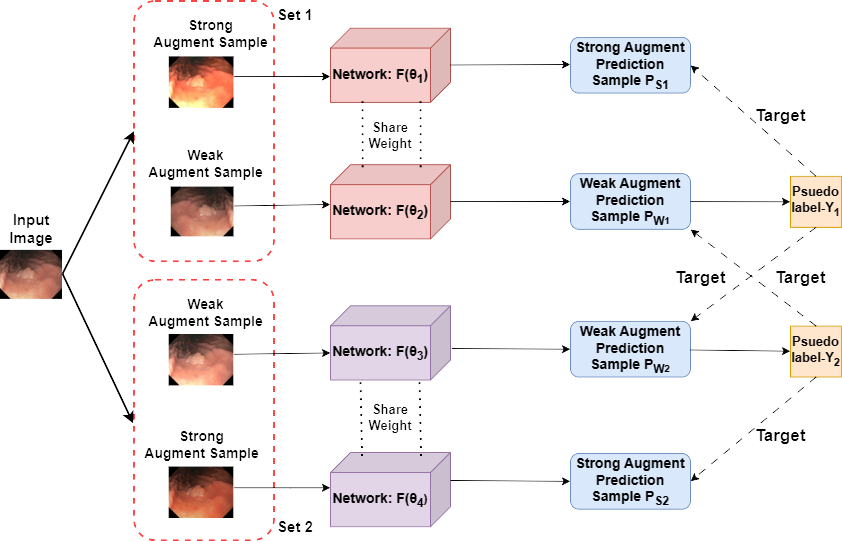
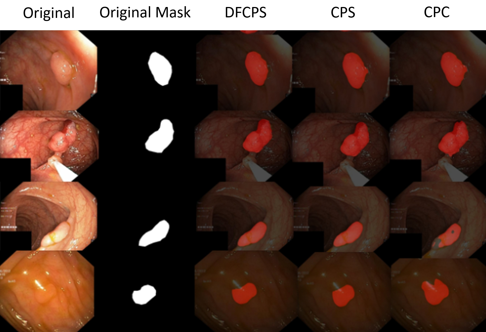

## DFCPS

Overall structure of the TC-DFCPS:


Model renderings:


## Running Instructions
1. Data preparation: support the import of medical image datasets, including CT scans, MRI images, etc., this time using the Kvasir-SEG dataset for segmentation, if necessary, you can replace the dataset.
2. Experimental environment: it is recommended to use NVIDIA graphics cards that support CUDA, the current set of experimental environment for the six card 2080ti, running on Ubuntu 20.04.1 system, opencv_python version is 4.2.0.34. Specific environmental dependencies exist in the file semiseg.yaml, please install the required python libraries before use. Please install the required python libraries before use, and please install git and add it to the system environment variable so that you can use the bash command.
3. Download the software installation package.
4. Extract the installation package to the target folder.
5. Open a command line terminal or Anaconda Prompt.
6. Prepare the environment
```
$ conda env create -f semiseg.yaml
$ conda activate semiseg
```
7. install apex 0.1 (requires CUDA)
```
$ cd . /furnace/apex
$ python setup.py install --cpp_ext --cuda_ext
```
8. Start training
```
$ cd . /exp.voc/voc8.res50v3+.CPS+DFCPS
$ bash train.sh
```
9. Start inference
```
$ bash eval.sh
```
10. Set the save location to get the segmentation results, please adaptive modification of the code save location according to personal needs.
