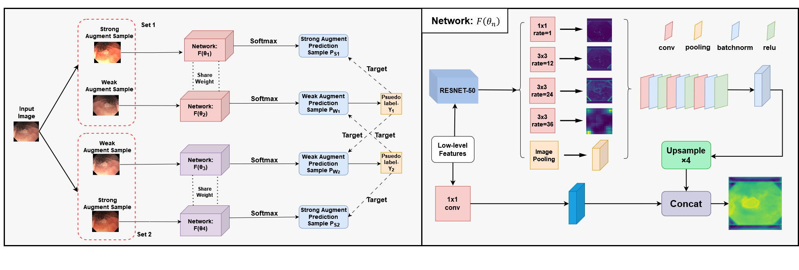

# DFCPS

Overall structure of the DFCPS:



Model renderings:


## 1. Installation

- Create a conda environment:

```
$ conda env create -f semiseg.yaml
$ conda activate semiseg
```

- Install apex 0.1 (requires CUDA)

```
$ cd . /furnace/apex
$ python setup.py install --cpp_ext --cuda_ext
```

The implementation of our model code references [TorchSemiSeg](https://github.com/charlesCXK/TorchSemiSeg), which you can also refer to for further details by checking out this model.

## 2. Data Preparation

- Download the data. Support the import of medical image datasets, including CT scans, MRI images, etc., this time using the Kvasir-SEG dataset for segmentation, if necessary, you can replace the dataset.

- Download the pre-trained ResNet models from  [OneDrive link](https://pkueducn-my.sharepoint.com/:f:/g/personal/pkucxk_pkueducn_onmicrosoft_com/EtjNKU0oVMhPkOKf9HTPlVsBIHYbACel6LSvcUeP4MXWVg?e=tChnP7).

```
DATA/
|-- Kvasir
|-- pytorch-weight
|   |-- resnet50_v1c.pth
|   |-- resnet101_v1c.pth
```

## 3. Training and Inference

```
$ cd . /exp.voc/voc8.res50v3+.CPS+DFCPS
$ bash script.sh
```
- The tensorboard file is saved in `log/tb/` directory.
- In `script.sh`, you need to specify some variables, such as the path to your data dir, the path to your snapshot dir that stores checkpoints, etc.

## 4. Different Partitions
To try other data partitions beside 1/8, you just need to change two variables in `config.py`:

```
C.labeled_ratio = 8
C.nepochs = 34
```

Please note that, for fair comparison, we control the total iterations during training in each experiment similar (almost the same), including the supervised baseline and semi-supervised methods. Therefore, the nepochs for different partitions are different.

## 5. Citation

```
@inproceedings{inproceedings,
author = {Chen, Yifei and Zhang, Chenyan and Ke, Yifan and Huang, Yiyu and Dai, Xuezhou and Qin, Feiwei and Zhang, Yongquan and Zhang, Xiaodong and Wang, Changmiao},
year = {2024},
month = {05},
pages = {1-5},
title = {Semi-Supervised Medical Image Segmentation Method Based on Cross-Pseudo Labeling Leveraging Strong and Weak Data Augmentation Strategies},
doi = {10.1109/ISBI56570.2024.10635443}
}
```
